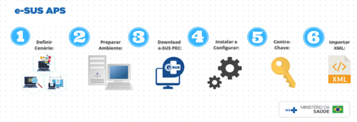

<h1>Como Implantar:</h1>

Como qualquer sistema de informação que se prese, a implantação do Prontuário Eletrônico do Cidadão (PEC),
requer o cumprimento de algumas premissas fundamentais, antes de sua adoção. Abaixo, segue o rol de etapas necessárias para à sua adesão: 

 

