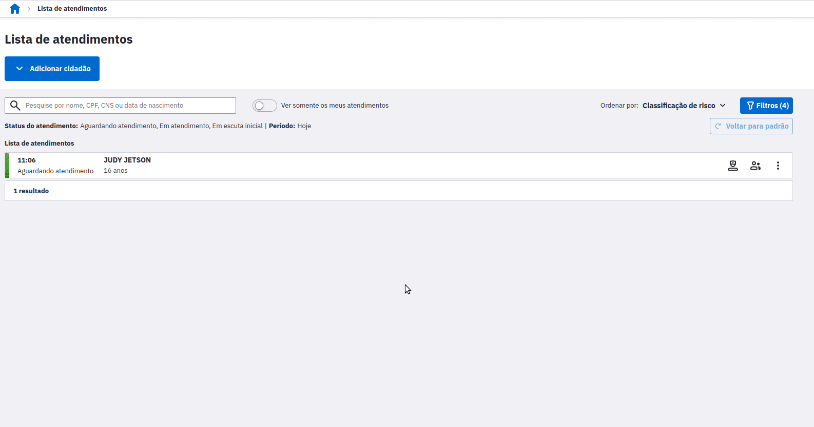
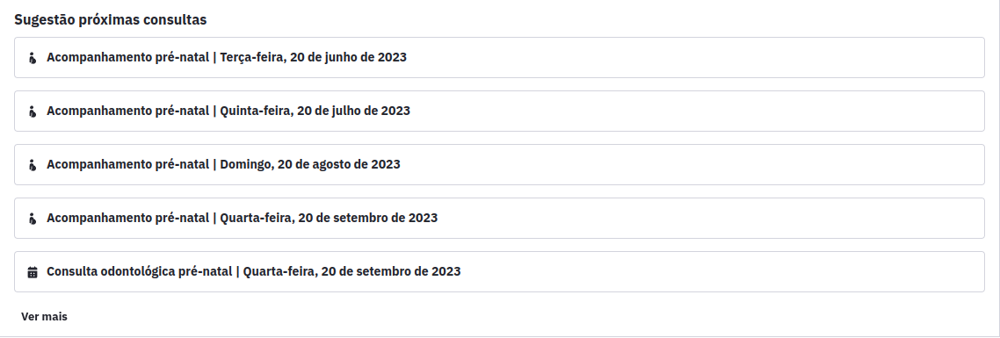
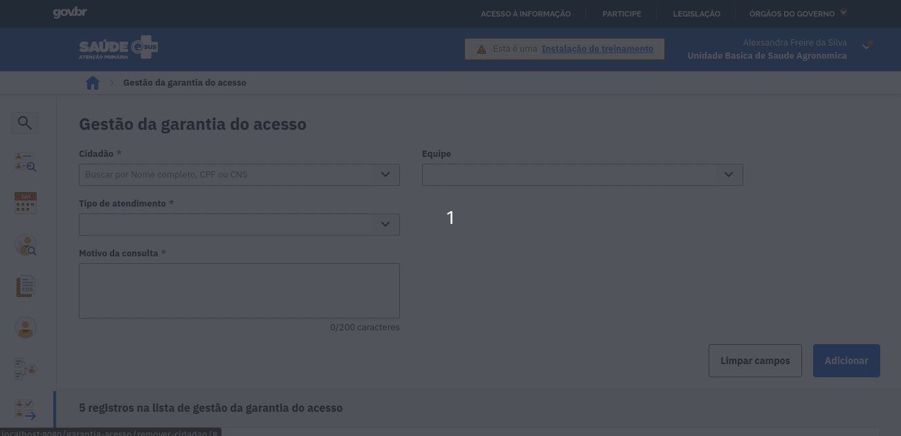
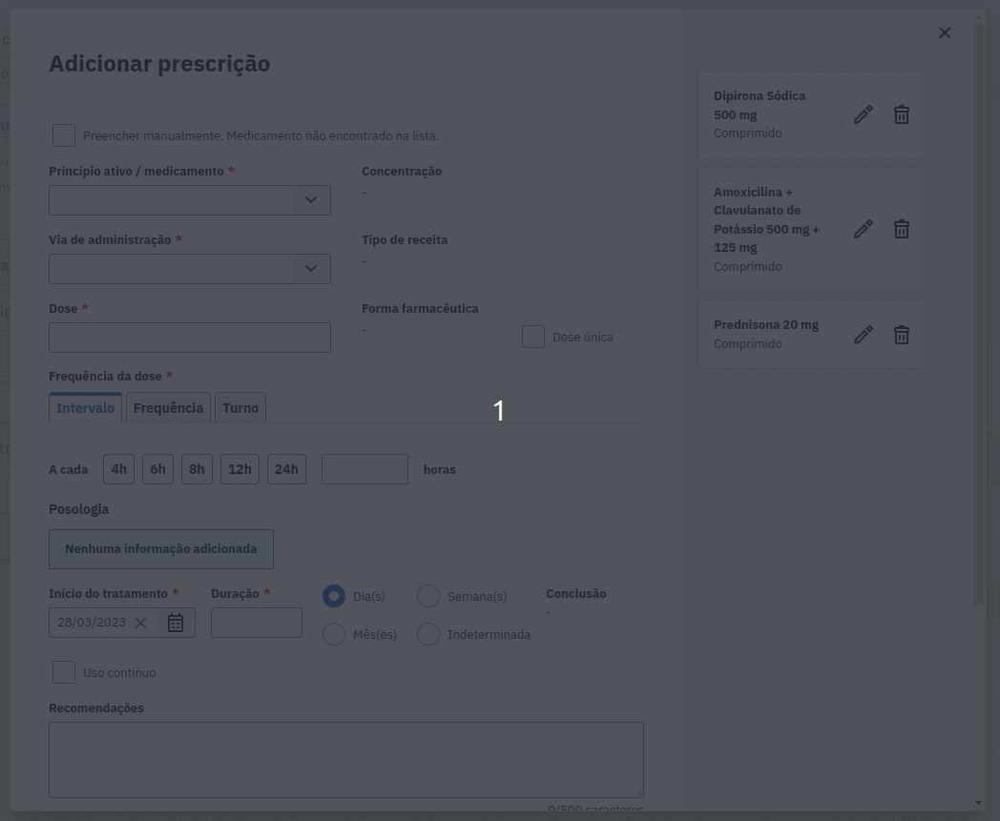
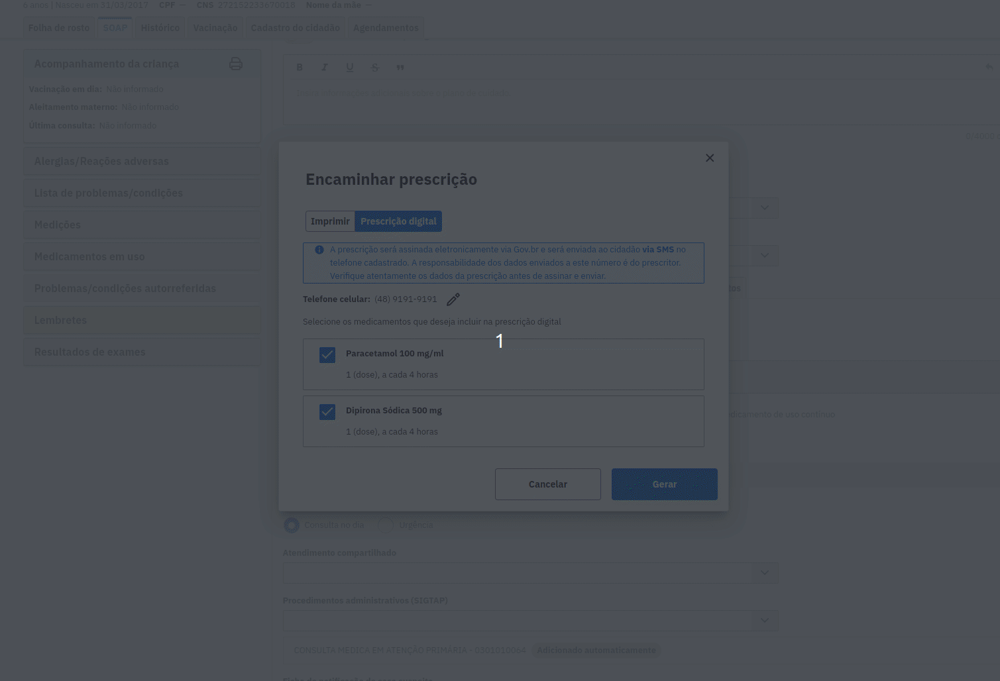
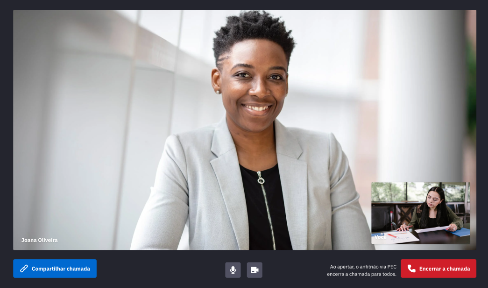
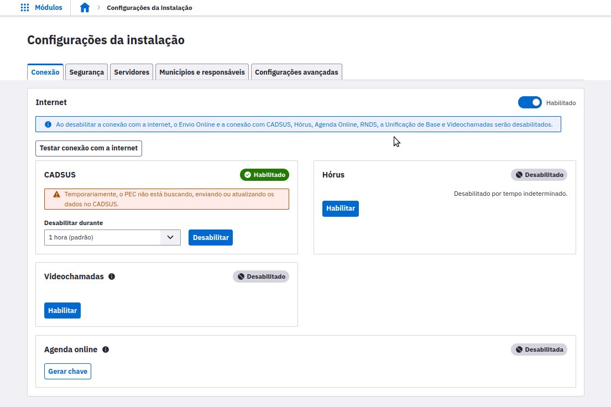
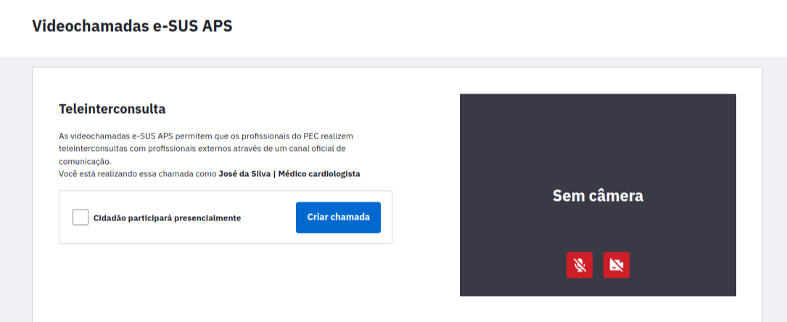
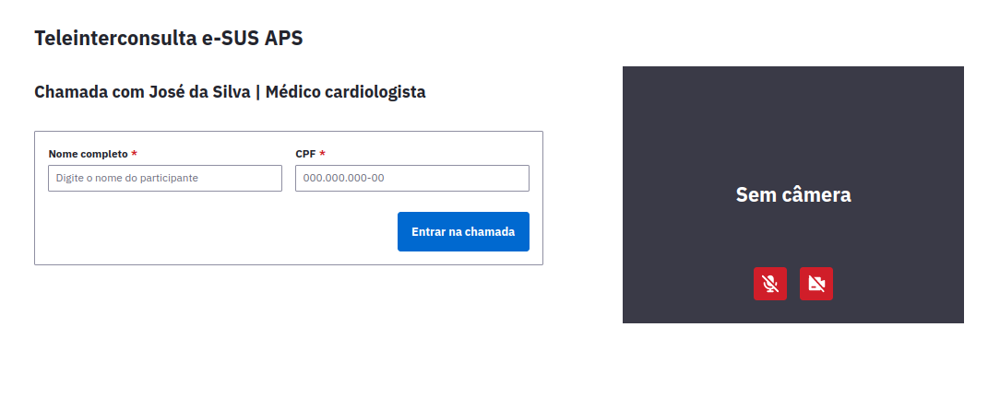
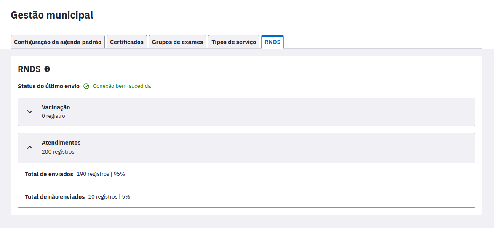

<link rel="stylesheet" type="text/css" href="../estilos.css">

<h1>Versão 5.2</h1>

<b>Novidades:</b>

Facilidades no agendamento de consultas de pré-natal:

- Gestão da garantia do acesso
- Prescrição digital
- Teleinterconsulta
- RNDS - Envio de atendimentos individuais
- Facilidades no agendamento de consultas de pré-natal

Com a nova funcionalidade de agendamentos, durante um atendimento de pré-natal, será possível realizar o <b>agendamento da próxima consulta para acompanhamento de pré-natal e a consulta odontológica de pré-natal.</b> O PEC irá <b>sugerir a data e lotação de profissional</b>, sendo que a pessoa responsável pelo atendimento tem liberdade para alterar essas informações conforme disponibilidade das partes envolvidas.

  - Para o acompanhamento de pré-natal, a data da próxima consulta é sugerida conforme a idade gestacional, respeitando as cadências estipuladas na caderneta da gestante, enquanto a lotação de profissional alterna entre profissionais com CBO de médico e enfermeiro.
  
  - Para as consultas odontológicas, é sugerida uma consulta a cada trimestre da gestação, enquanto a lotação de profissional sugerida será de profissional com CBO de dentista.
    

 
- Ainda durante os atendimentos de pré-natal, serão apresentadas as sugestões de quais serão todas as datas que deverão ocorrer os próximos acompanhamentos de pré-natal, bem como um atendimento odontológico a cada trimestre da gestação.
 
 

<b>Gestão da garantia do acesso.</b>
 
 
Nesta nova atualização, o PEC passa a contar com o novo módulo de gestão da garantia do acesso, o objetivo do módulo é permitir que os profissionais possam criar uma lista para gerir a demanda reprimida dos estabelecimentos de saúde. Através do módulo poderão ser visualizados os contatos e demandas dos cidadãos que buscaram atendimento e não conseguiram acesso ao serviço e direcioná-los para um possível agendamento futuro.
 

 

<b>Prescrição Digital</b>

 
- Ao encaminhar a prescrição de medicamentos para o cidadão, será possível optar por realizar a impressão ou gerar uma prescrição digital através da opção “Prescrição digital”, caso a instalação esteja habilitada para gerar prescrições digitais. O documento da prescrição digital será gerado no formato PDF e enviado ao cidadão, que poderá utilizá-lo para retirar medicamentos. Na farmácia, será possível registar que os medicamentos da prescrição foram fornecidos.
 
 

- A prescrição digital será encaminhada ao cidadão via SMS. É possível editar o telefone celular antes de encaminhar clicando no ícone de edição ao lado do número.
     

 

- Para gerar a prescrição digital, é necessário realizar uma assinatura eletrônica do documento. O PEC irá abrir uma nova janela para o processo de assinatura.  

 

<b>Teleinterconsulta</b>
 

A partir desta atualização, é possível realizar teleinterconsultas diretamente no PEC através do novo módulo Videochamadas. Assim, essa modalidade de consulta entre dois profissionais pode agora ser feita através de um canal oficial de comunicação.

 

Para utilizar essa nova funcionalidade, é necessário que o acesso à instalação seja feito utilizando o protocolo HTTPS e que o Administrador da Instalação habilite as videochamadas nas configurações de internet:

 

 

Depois disso, basta que seja criada uma nova chamada no módulo Videochamadas e que seja enviado o link de acesso para o profissional com quem se deseja realizar a teleinterconsulta, seja ele usuário do PEC ou não. O profissional que receber o link consegue então acessar a teleinterconsulta após preencher seus dados.

 

 
 

 

<b>RNDS - Envio de atendimentos individuais</b>
 
 ****

- Agora, para as instalações com a RNDS configurada, os registros dos Atendimentos Individuais serão enviados à Rede Nacional de Dados em Saúde (RNDS) ao finalizar o respectivo atendimento.

- Atualizada a página para visualização da quantidade de registros enviados, localizada no módulo de "Gestão municipal", aba "RNDS". Agora, também haverá informações de envio sobre os registros de atendimentos.
 

