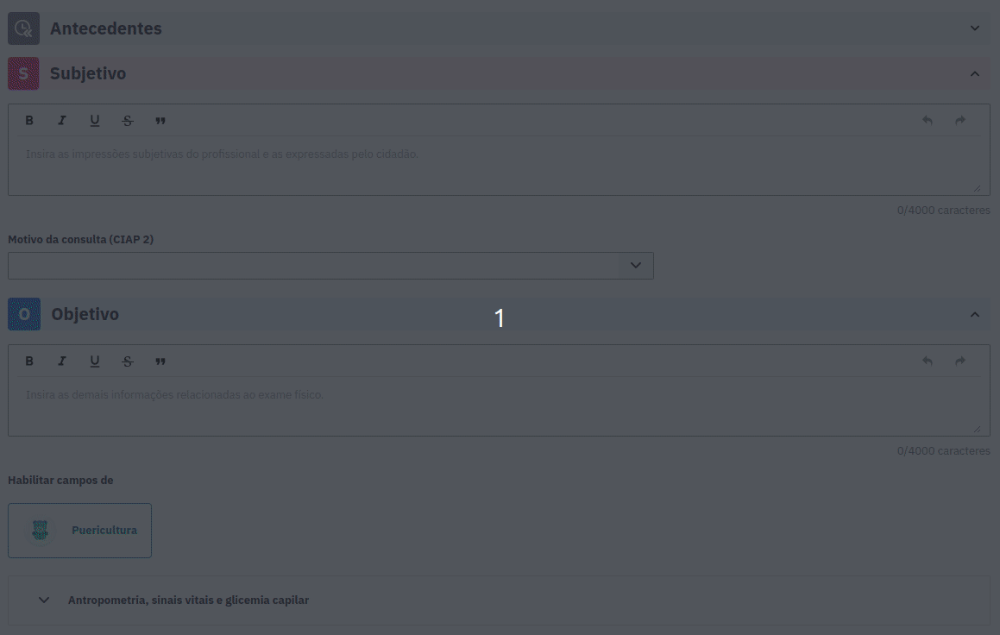
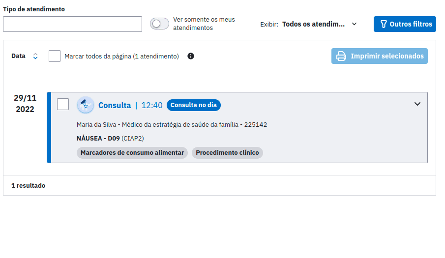
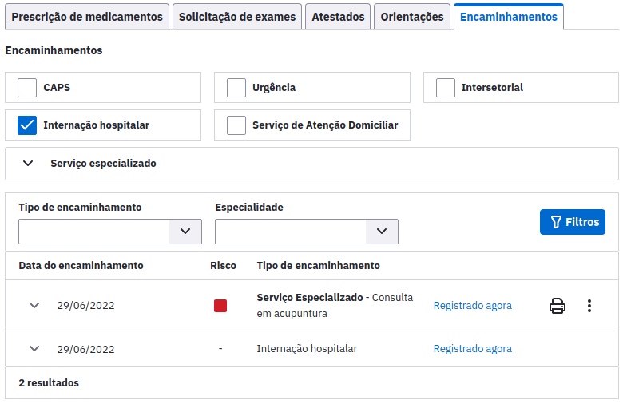
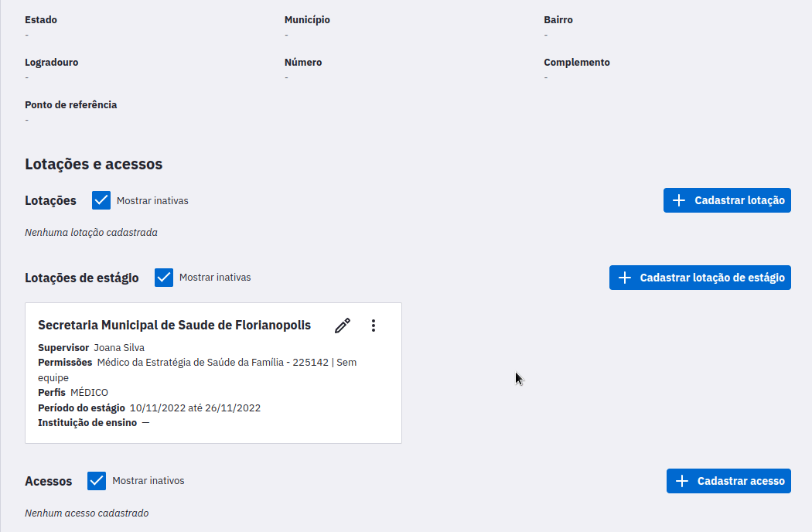
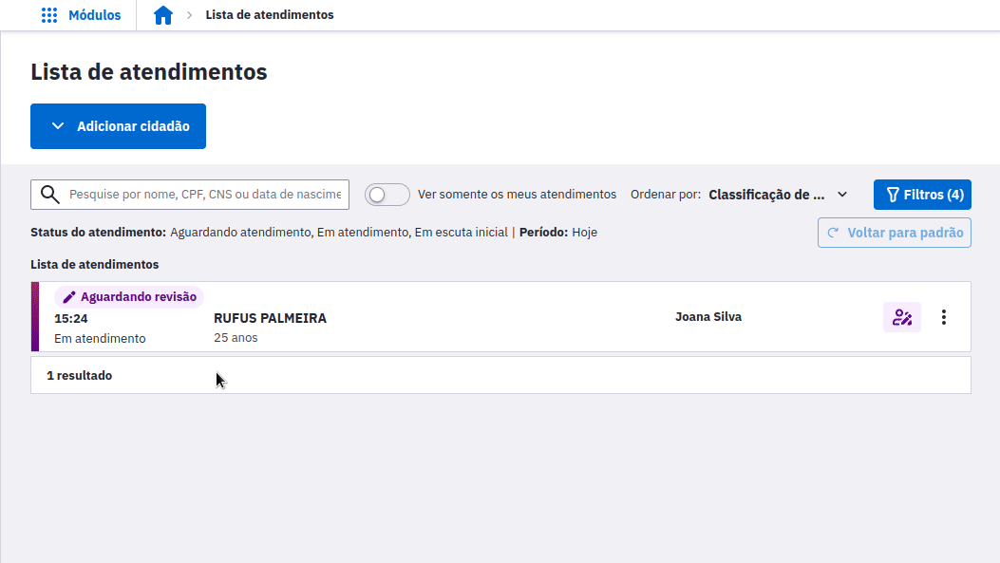
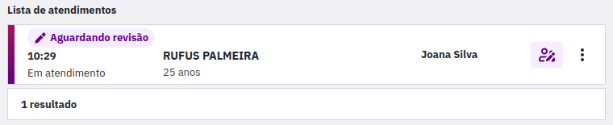
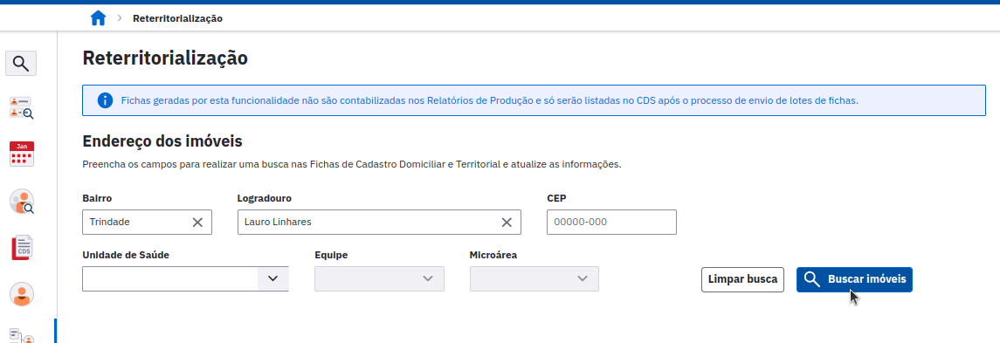
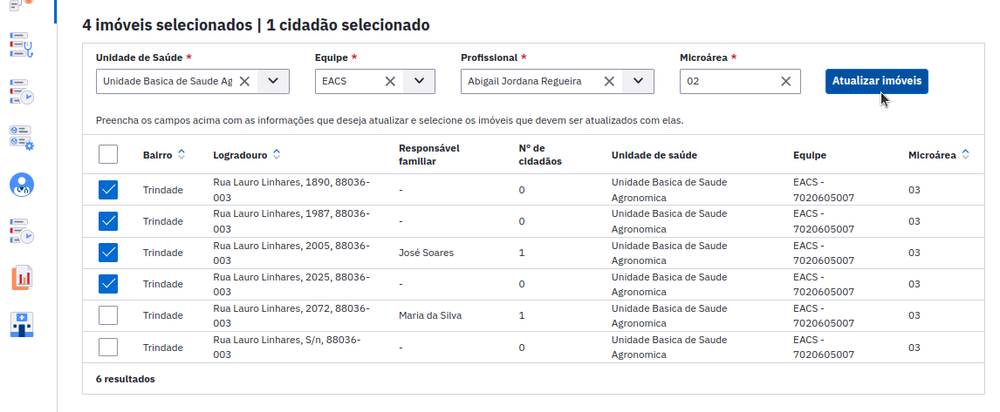
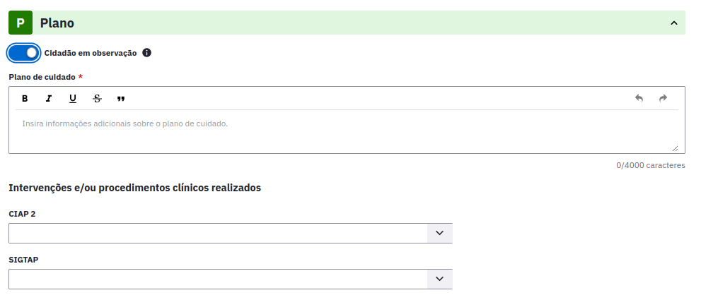
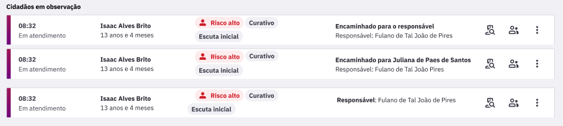

<link rel="stylesheet" type="text/css" href="../estilos.css">

<h1>Versão 5.1</h1>

Módulos com novidades:
<ul>
    <li>Marcadores de consumo alimentar</li>
    <li>Busca ativa de vacinação</li>
    <li>Encaminhamento externo</li>
    <li>Adaptação do PEC para uso do estagiário</li>
    <li>Reterritorialização</li>
    <li>Observação do cidadão</li>
    <li>Registro tardio</li>
    <li>Acompanhamento de cidadãos vinculados</li>
    <li>RNDS - Envio de vacinas</li>
</ul>

<h3>Marcadores de consumo alimentar</h3>
 

* Agora é possível registrar o marcador de consumo alimentar do cidadão diretamente no atendimento. A opção foi incluída no Objetivo do SOAP em quase todos os tipos de atendimento e o formulário é apresentado de acordo com a idade do cidadão.

 

* As informações de consumo alimentar registradas no atendimento também são apresentadas no histórico e impressão. É possível reconhecer um atendimento com esse registro através da etiqueta “Marcadores de consumo alimentar".

Busca ativa de vacinação

* Agora é possível realizar a Busca ativa de vacinação, que retorna uma listagem exibindo os dados dos cidadãos que possuem doses de imunobiológicos atrasados ou no prazo para aplicação a partir das vacinas do calendário vacinal, e também as doses de imunobiológicos aplicados para as vacinas de Covid-19. É possível também realizar a exportação do relatório em formato CSV para manipulação dos dados.

* O resultado na listagem é filtrado a partir dos seguintes campos:

    * Grupo-alvo: irá filtrar os cidadãos por grupos-alvo do calendário vacinal e os cidadãos que estão na faixa etária selecionada para as vacinas de Covid-19;

    * Status da vacina: para as vacinas do calendário vacinal, será possível filtrar os imunobiológicos e suas respectivas doses pelos status Atrasada (vacinas não tomadas dentro do calendário vacinal) ou No prazo (vacinas não tomadas do calendário vacinal que estão dentro do prazo para aplicação), e para as vacinas de Covid-19, será possível filtrar os imunobiológicos e suas respectivas doses pelos status Aplicada.

* Estão disponíveis para seleção os grupos alvo de "Crianças (0 a 9 anos)" e "Adolescentes (10 a 19 anos)".

* Para gerar a listagem com os filtros selecionados, basta clicar no botão "Buscar cidadãos". Então, será exibida a listagem com as seguintes colunas: Cidadão, Idade, Endereço, e Status da vacina (Atrasada ou No prazo para o Calendário vacinal e Aplicada para as vacinas de Covid-19).

* A listagem pode ainda ser ordenada pelas colunas: Cidadão, Idade.

Encaminhamento externo

* Agora é possível registrar novos tipos de encaminhamento externo na seção de Plano dos atendimentos. Foram incluídas as opções:

* CAPS;
* Urgência;
* Internação hospitalar;
* Serviço de Atenção Domiciliar;
* Intersetorial.

Adaptação do PEC para uso do estagiário

A nova funcionalidade permite que estagiários utilizem o PEC e tenham os atendimentos validados pelo supervisor antes da finalização. Foram inseridos os seguintes fluxos no sistema para adaptá-lo ao uso do estagiário:

* Login individual para o estagiário;
* Cadastro de uma lotação de estágio com um respectivo supervisor;

* Retificação dos atendimentos realizados pelo estagiário antes do início da revisão pelo supervisor;
* Revisão dos atendimentos feitos pelo estagiário antes da finalização;

* Atualizações no Histórico para apresentar atendimentos realizados por estagiários;
* Novos status na Lista de Atendimento para suportar as funcionalidades.

Reterritorialização

* Agora é possível atualizar rapidamente o território dos imóveis e seus respectivos núcleos familiares. Com esta nova funcionalidade, a atualização das informações que determinam a responsabilidade de acompanhamento no território poderá ser feita de uma forma rápida e consolidada, sem a necessidade de se atualizar ficha por ficha.

* Acesse a seção "Gestão de Cadastros" e a aba de Reterritorialização. Nesta tela basta realizar uma busca pelos imóveis desejados.

* Aí então basta selecionar na lista quais deles devem ser reterritorializados, informar os novos dados e clicar em "Atualizar imóveis".

* Este processo preserva automaticamente os núcleos familiares envolvidos, gerando novas fichas de atualização assim que um novo lote de fichas for gerado e enviado.

Observação do cidadão

* Agora é possível registrar no prontuário que um cidadão deve ficar em observação. Para tanto é necessário ativar o botão “Cidadão em observação” que irá liberar um novo fluxo no sistema:

* Na lista de atendimentos os cidadãos em observação ficarão em uma seção separada;

* O profissional que iniciou a observação é considerado o profissional responsável, sendo este o único que poderá finalizar o atendimento de observação;

* Os outros profissionais que participarem da observação são considerados profissionais auxiliares, pois o foco desses profissionais é estabilizar o cidadão de acordo com o plano de cuidado prescrito pelo profissional responsável. Sendo que, os atendimentos dos profissionais auxiliares terão o mesmo formato que um atendimento de procedimentos com as seguintes mudanças:

    * A cada ponto de contato que o profissional tiver com o cidadão dentro de uma observação deve ser possível registrar uma medição;

    * O histórico de plano de cuidados deve ser exibido no Plano do SOAP, contendo todos os planos de cuidado realizados pelos profissionais da saúde para aquele atendimento de observação;

    * Nos atendimentos do profissional responsável todas as informações se mantêm, sendo possível realizar mais de uma medição, além de adicionar o histórico de plano de cuidados no Plano do SOAP;

Print plano de cuidado

Acompanhamento de cidadãos vinculados

* Com o novo acompanhamento é possível buscar, imprimir e exportar todos os cidadãos que são acompanhados pelas equipes da unidade de saúde, até mesmo aqueles que não pertencem a um núcleo familiar, ou seja, unidades que não utilizam o CDS, poderão visualizar os cidadãos no relatório, desde que em seu cadastro esteja informada a equipe responsável pelo cidadão.

* O Acompanhamento de cidadãos vinculados fica em um novo menu de Acompanhamentos, agrupado ao Acompanhamento de condições de saúde.

* Por padrão, os profissionais com os perfis Coordenador da UBS, ACS, TSB, Outros profissionais de nível superior NASF, Outros profissionais de nível superior, Outros profissionais de nível médio técnico, ASB, Auxiliar ou técnico de enfermagem, Cirurgião dentista, Enfermeiro, Farmacêutico e Médico terão acesso ao novo relatório. Com exceção do Coordenador da UBS, os demais profissionais só visualizam cidadãos relacionados às suas respectivas equipes.

Gif mostrando o funcionamento do acompanhamento de cidadãos vinculados

Redesign do módulo Registro tardio

* Nova interface! O módulo foi redesenhado a fim de facilitar a sua utilização, mantendo estrutura do atendimento individual;

Layout antigo do registro tardio

Permissão de agendamento do Registro tardio quando a justificativa for fora da UBS através do módulo da agenda;

Demonstração da funcionalidade de agendamento do registro tardio com a justificativa de "Fora da UBS" através do módulo da agenda.Imagem de pause

* Permissão de registros de atendimentos de até 7 dias anteriores a data atual que não puderam ser registrados no dia do atendimento;

* Possibilidade de cancelar registro na própria listagem caso ele tenha excedido o prazo ou possua outro mais recente que ele;

* Ao tentar realizar um registro com atendimento mais recente, são exibidas informações do atendimento posterior em uma modal;

Demonstração das funcionalidades de registro de atendimentos realizados até 7 dias anteriores a data atual, cancelamento de registro por tempo excedido e exibição de informações de atendimentos mais recentes. Imagem de pause

* Possibilidade de agendar um atendimento Fora da UBS na finalização do atendimento.

Demonstração de funcionalidade de agendamento de atendimento Fora da UBS na finalização do atendimento.Imagem de pause

RNDS - Envio de vacinas

* Agora, para as instalações com a RNDS configurada, os registros de vacinação serão enviados à Rede Nacional de Dados em Saúde (RNDS) ao finalizar o atendimento de vacinação. Além disso, as transcrições de caderneta também serão enviadas.

* Nova página para visualização da quantidade de registros enviados, localizada no módulo de "Gestão municipal", aba "RNDS".

Gif mostrando o funcionamento do acompanhamento de cidadãos vinculados

