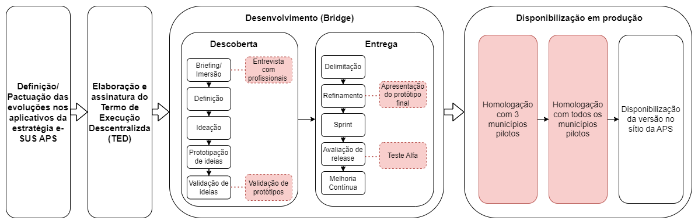
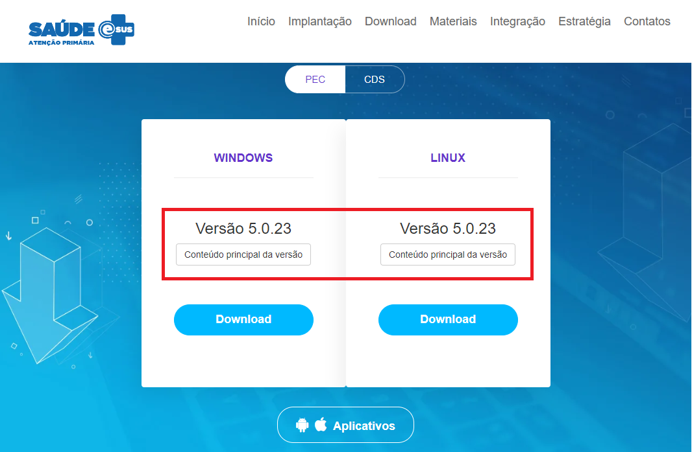

<link rel="stylesheet" type="text/css" href="../estilos.css">

<h1> Etapas de Desenvolvimento e Contribuição dos Pilotos da Estratégia e-SUS APS: </h1>

Objetivando maximizar a compreensão sobre os processos que norteiam o processo de homologação das versões da Estratégia e-SUS APS, destacamos abaixo, o mapeamento dos processos com o descritivo das principais etapas de homologação do Prontuário Eletrônico do Cidadão (PEC) e aplicativos, conforme segue abaixo:
 
 

**Principais atores envolvidos:**

1 - Secretaria de Atenção Primária à Saúde (SAPS);  
2 - Laboratório Bridge; 
3 - Municípios Pilotos da Estratégia e-SUS APS; 
4 - Profissionais de saúde do município; 
5 - CONASS; 
6 - CONASEMS. 

**Descrição das principais etapas:**

Uma vez identificado as necessidades pela área demandante (Ministério da Saúde, Municípios Pilotos, Conass, Conasems, Órgãos de Controle, Canal de Suporte, etc ), o recurso ou funcionalidade é discutido internamente pelas áreas técnicas e negociais do Ministério da Saúde e Parceiros da Estratégia (Pilotos, CONASS, CONASEMS), para posterior submissão da proposta à Equipe do Laboratório Bridge para construção técnica da solução de software que atenderá as necessidades, conforme a proposição apresentada.

<b>Abaixo, segue o descritivo das principais etapas, após identificação da necessidade:</b>

1- **Pactuação:** Na fase de pactuação, são identificadas necessidades e oportunidades de melhoria na evolução dos aplicativos da Estratégia e-SUS APS. Tais evoluções são criadas a partir de diversas fontes de entrada, dentre elas: Canal de Sugestões, Suporte, CONASS, CONASEMS, Municípios Pilotos, requisições externas/internas ao Ministério da Saúde, etc;

2- **Elaboração do TED:** Uma vez definido o escopo, tal necessidade é corroborada por meio de um Termo de Execução Descentralizada (TED), que nada mais é do que uma pactuação firmada entre o Ministério da Saúde e a Universidade Federal de Santa Catarina (UFSC), à prestação do serviço de desenvolvimento de software;

3- **Desenvolvimento:** Uma vez firmado o TED, a próxima etapa refere-se ao desenvolvimento da solução de software que atenda a necessidade delimitada; Esta fase é compreendida por duas etapas e diversas subfases, conforme pode ser visto abaixo:
 
 
    a. **Discovery:** nesta fase, profissionais de saúde dos Municípios Pilotos são entrevistados (briefing), requisitos e necessidades são levantados e discutidos internamente, para a definição, ideação, prototipação e validação de ideias necessárias à construção do software. Em seguida, teremos a validação dos protótipos para aferição do que será construído, o esforço a ser empregado e o tempo necessário para o desenvolvimento;
 
 
    b. **Entrega:** Nesta fase, realizam-se ajustes de implementação e refinamento do produto a ser entregue, bem como apresentação do protótipo final e realização do **Teste Alfa** pelos Municípios Pilotos da Estratégia e-SUS APS; após realização dos testes, caso não haja qualquer embargo ou rejeição à liberação do software, a próxima etapa refere-se a liberação da versão no ambiente de homologação para continuidade dos testes.
 

5- **Liberação em Homologação:** Nesta fase, o software é disponibilizado aos municípios Pilotos que compõem a Estratégia e-SUS APS, para que testes possam ser realizados, erros identificados, oportunidades de melhoria possam ser implementadas e cargas de estresse possam ser executadas, para aferição da performance da aplicação; Uma vez aprovado, os Municípios Pilotos assinam **Parecer Técnico**, dando aval à liberação da versão em ambiente de produção e publicação da nova versão no sítio da APS;

6- **Liberação no Portal da APS:** Recebido aval para liberação, a versão é disponibilizada no Sítio da APS, para que o e-SUS possa ser utilizado em escala nacional, conforme link: https://sisaps.saude.gov.br/esus/
 
 

