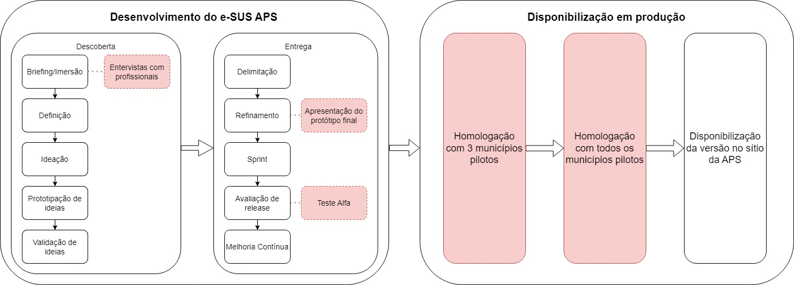

<link rel="stylesheet" href="https://cdn.jsdelivr.net/npm/bootstrap@4.0.0/dist/css/bootstrap.min.css" integrity="sha384-Gn5384xqQ1aoWXA+058RXPxPg6fy4IWvTNh0E263XmFcJlSAwiGgFAW/dAiS6JXm" crossorigin="anonymous">

<nav>
  

    <a class="nav-item nav-link active" id="nav-home-tab" data-toggle="tab" href="#nav-home" role="tab" aria-controls="nav-home" aria-selected="true">Home</a>
    <a class="nav-item nav-link" id="nav-planejamento-tab" data-toggle="tab" href="#nav-planejamento" role="tab" aria-controls="nav-planejamento" aria-selected="false">Planejamento</a>
    <a class="nav-item nav-link" id="nav-entrevistas-tab" data-toggle="tab" href="#nav-entrevistas" role="tab" aria-controls="nav-entrevistas" aria-selected="false">PlanejamentoPlanejamento</a>
  

</nav>

  

    <h1> Etapas de Desenvolvimento e Contribuição dos Pilotos da Estratégia e-SUS APS: </h1>
     
     
    
Objetivando maximizar a compreensão sobre os processos que norteiam o processo de homologação das versões da Estratégia e-SUS APS, destacamos abaixo, o mapeamento dos processos com o descritivo das principais etapas de homologação do Prontuário Eletrônico do Cidadão (PEC) e aplicativos, conforme segue abaixo:

    

  

  
Planejamento

  
Planejamento

