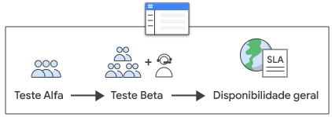

<link rel="stylesheet" type="text/css" href="../estilos.css">

<h1> Teste Alfa:</h1>

Antes do Prontuário Eletrônico do Cidadão (PEC) e aplicativos serem disponibilizados no Portal da Atenção Primária (APS) para ampla utilização, as soluções de software da Estratégia e-SUS APS são submetidas a várias baterias de teste que visam atestar a integridade do sistema e a ocorrência de eventuais anomalias que não foram identificadas nas etapais finais de concepção do sistema; dentre as modalidades de testes mais difundidas e amplamente empregadas, destacamos o teste alfa e beta de software, conforme texto abaixo:

 

## Teste Alfa:

Alfa é um teste de disponibilidade limitada realizado antes que as versões sejam liberadas para uso mais difundido. O objetivo com o teste Alfa é verificar a funcionalidade e coletar feedback de um conjunto limitado de clientes; esta modalidade de teste de software também é executado para identificar bugs antes de lançar o produto para usuários reais ou para o público. É considerado um teste de aceitação de usuário.

## Teste alfa no PEC:

No âmbito do Prontuário Eletrônico do Cidadão (PEC), solicitamos aos profissionais que percorram alguns fluxos do sistema e avaliem algumas perguntas realizadas conforme a atividade proposta.

As tarefas geralmente são realizadas na versão de homologação do sistema (que contém apenas dados de cidad~so fictícios), disponível em link previamente disponibilizado.

**Algumas orientações:**

* As tarefas propostas devem ser realizaads por profissionais que utilizam o sistema no seu dia a dia;
* Os profissionais deverão simular a sua rotina de trabalho e os possíveis imprevistos que podem acontecer durante a utilização do sistema, a fim de avaliar se há algo a ser melhorado na nova funcionalidade.

**OBSERVAÇÃO:** A avaliação deverá ser feita utilizando o formulário fornecido e deverá ser respondido até a data proposta. Em caso de dificuldades ou erros durante o preenchimento do formulário, orientamos encaminhar e-mail para **piloto.esusab@saude.gov.br** ou o relato deverá ser registrado no Grupo dos Pilotos no WhatsApp.

